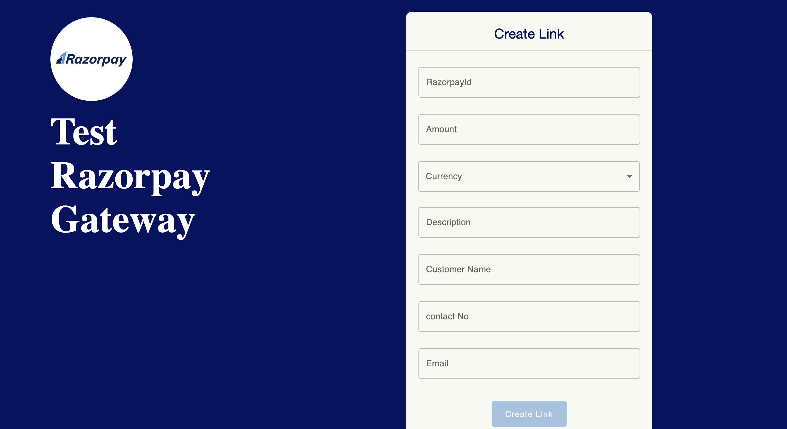

This is a [Next.js](https://nextjs.org/) project bootstrapped
with [`create-next-app`](https://github.com/vercel/next.js/tree/canary/packages/create-next-app).

## Payment Gateways

Payment Gateway is an innovative open-source project that enables you to make secure online transactions with ease. The
project currently supports two popular payment gateways, Razorpay and Paytm, allowing you to make payments using either
of these options.

Moreover, Payment Gateway allows you to create custom payment links that you can share with your customers, making it
easier for them to make payments. This feature is particularly useful for businesses that operate online and require a
seamless payment process.

## Getting Started

You can run this application directly from the [Link]
(http://example.com "Link").

First, run the development server:

```bash
npm run dev
# or
yarn dev
# or
pnpm dev
```

Open [http://localhost:3000](http://localhost:3000) with your browser to see the result.

You can start editing the page by modifying `pages/index.tsx`. The page auto-updates as you edit the file.

[API routes](https://nextjs.org/docs/api-routes/introduction) can be accessed
on [http://localhost:3000/api/hello](http://localhost:3000/api/hello). This endpoint can be edited
in `pages/api/createOrderApi.ts`.

The `pages/api` directory is mapped to `/api/*`. Files in this directory are treated
as [API routes](https://nextjs.org/docs/api-routes/introduction) instead of React pages.

This project uses [`next/font`](https://nextjs.org/docs/basic-features/font-optimization) to automatically optimize and
load Inter, a custom Google Font.

## Key features

### Home Page

On the homepage, there are two dropdown that allow the user to select a specific gateway`razorpay`, `paytm` and its
corresponding options.
Once the user has selected their desired gateway and options,
can click the submit button.
This will redirect them to the appropriate screen that corresponds to their chosen gateway and options
<p>

</p>

### Razorpay

razorpay offers three different options for users to make payments: `Create Order` `Complete Payment`
and `Payment Link`. Each option has a specific purpose and will redirect the user to a dedicated page.

- [CreateOrder](#CreateOrder) : The `Create Order` option is used when the user wants to generate an order.
- [CompletePayment](#CompletePayment): The `Complete Payment` option is used when the user has already created 
- an order and wants to complete the payment process. 
- [PaymentLink](#PaymentLink) :  The `Payment Link` option is used when the user wants to share a payment link with others.

<p>

</p>

### Paytm

Similar to razorpay, paytm have two options for users to make payments: `PaytmOrder` `PaytmLink`.
- [PaytmOrder](#PaytmOrder) : The `PaytmOrder` option is used when the user wants to generate an order and payment via paytm.
- [PaymentLink](#PaymentLink) :  The `Payment Link` option is used when the user wants to share a payment link with others.
<p>

</p>

### CreateOrder
The `Create Order` page on Razorpay allows users to generate an order for their product by providing the necessary information, including the `Razorpay ID` and  `amount` to be charged ,`Currency` and  `description` . Once all the required information is entered,it will redirect to the
order successful screen and users can proceed 
to the payment stage to complete the payment.

<p>

</p>

### CompletePayment
On the `Complete Payment` page of Razorpay, users can enter the required details like the `Razorpay ID` and `Order ID` to complete the payment for their order. Once the details are provided, and click on the submit button , the Razorpay payment gateway loads on the screen, where users can enter their payment information to complete the transaction.

If the payment is successful, a response displaying the payment details and status will appear on the screen. However, if the transaction fails for any reason, a message indicating the payment failure will be displayed.
<p>

</p>

### PaymentLink
`paymentLink` page allows you to create a unique link for customers to make a payment. By providing details such as the `RazorpayID`, `description`, `amount`, `currency`, `Contact No`, and `email`, you can generate a secure payment link. This link can then be sent to the customer via email or text message, allowing them to conveniently make a payment.

Once the customer receives the link, they can click on it and be directed to a secure payment page to complete the transaction. By including their contact number and email address, they will also receive an automatic confirmation of the payment made.
<p>

</p>

### PaytmOrder
On the `paytmOrder` page by providing details such as the `merchant ID (MID)`, `merchant key (MKEY)`, and order `amount`, clicking the "Submit" button will open the Paytm gateway on your screen for payment. The gateway will prompt you to enter the necessary details required for payment via Paytm. Once you have entered the required details and completed the payment process, Paytm will redirect you to a response screen to display the status of your transaction. This response screen will provide information on whether the transaction was successful or not
<p>

</p>

### PaytmLink
On the `Paytmlink` screen, you have the option to create a Paytm link by providing the necessary information such as the `MID (Merchant ID)`,  `amount` and the `description` of the transaction. Once you have entered these details, simply click on the submit button and Paytm will generate a unique payment link.

This payment link can then be sent to your customers via email, text message, or any other preferred mode of communication. The customer can use the link to make the payment against the transaction. This process simplifies the payment process for both you and your customer, as it eliminates the need for sharing bank account details or other sensitive information.
<p>

</p>


